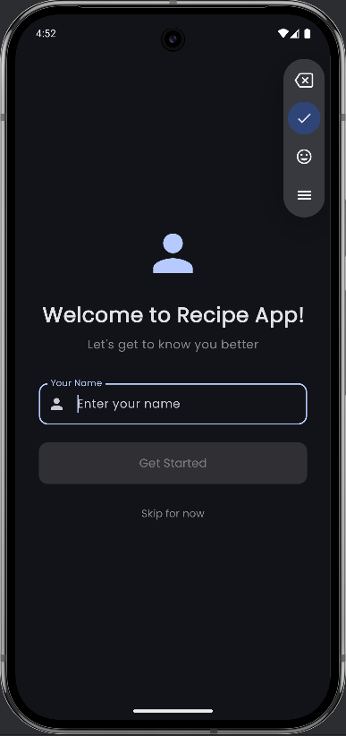
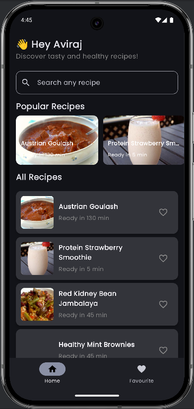
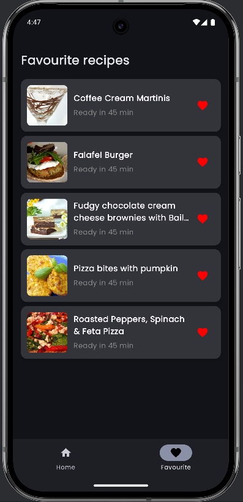
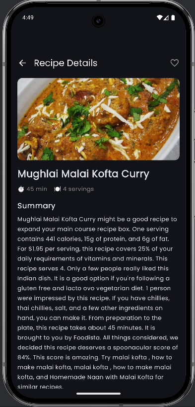
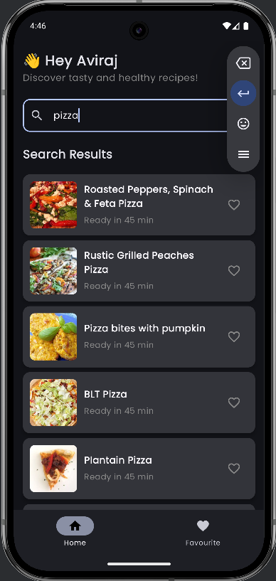

# RecipeSearchApp

## Description

This is an Android application developed as part of a technical assignment. The app demonstrates modern Android development using Kotlin, Jetpack Compose, Retrofit, Room, Hilt, Coil, and MVVM architecture pattern.

## Screenshots

### App Screenshots

<table>
  <tr>
    <td align="center">
      
      <br><br>
      <strong>Welcome Screen</strong>
      <br>
    </td>
    <td align="center">
      
      <br><br>
      <strong>Home Screen</strong>
      <br>
    </td>
    <td align="center">
      
      <br><br>
      <strong>Favorite Screen</strong>
      <br>
    </td>
    <td align="center">
      
      <br><br>
      <strong>Detailed Screen</strong>
      <br>
    </td>
    <td align="center">
      
      <br><br>
      <strong>Search Recipe</strong>
      <br>
    </td>
  </tr>
</table>

## Screen Recording/Demo

### App Demo

<tr>
  <td align="center">
    <a href="https://www.youtube.com/shorts/V4rCMos8Rc0">
      🎥 Watch App Demo on YouTube
    </a>
    <br>
  </td>
</tr>


## Setup and Installation

### Prerequisites
- Android Studio
- JDK 11+
- Android SDK (API 24+)

### Steps
1. Clone the repository:
   ```bash
   git clone https://github.com/aviirajsharma/Assignment1.git
   ```
2. Open in Android Studio
3. Sync the project
4. Run the app


